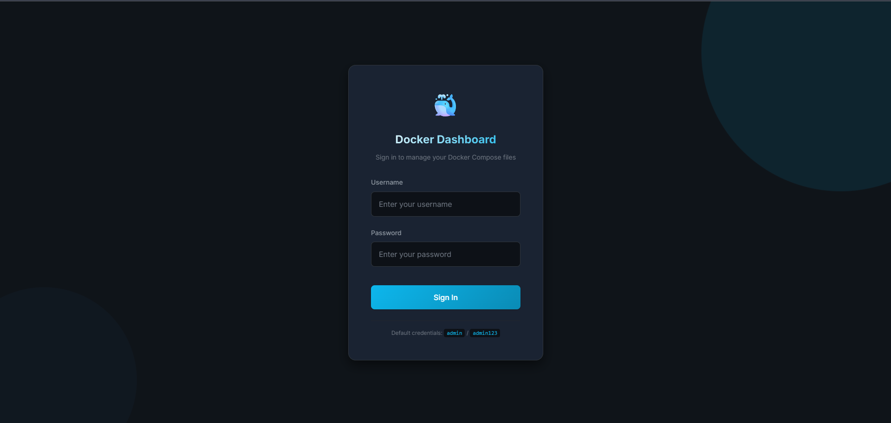
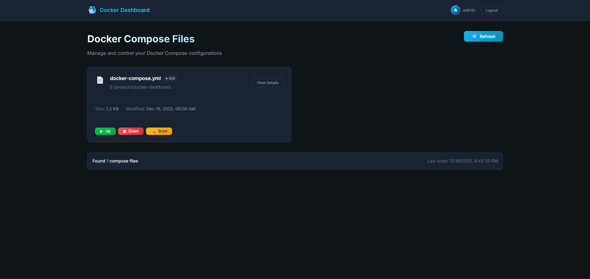
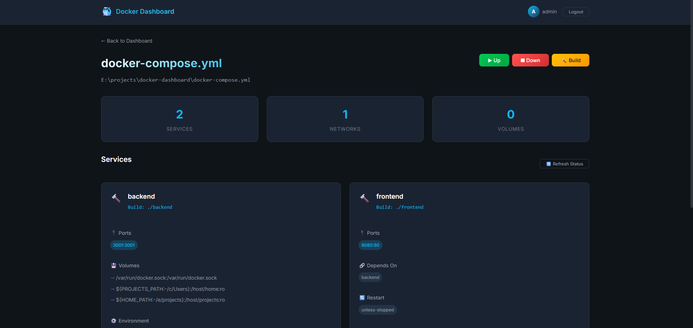

# 🐳 Docker Dashboard

A full-stack web dashboard for managing Docker Compose files on your system. Built with Vue.js (frontend) and Node.js/Express (backend).


## ✨ Features

- **File Discovery**: Automatically scans configured directories for docker-compose files
- **Service Details**: View parsed YAML with services, ports, volumes, and environment variables
- **Command Execution**: Run `up`, `down`, and `build` commands directly from the UI
- **JWT Authentication**: Secure access with token-based authentication
- **Modern UI**: Dark theme with glassmorphism effects and smooth animations

## 📸 Screenshots

### Login Page


### Dashboard


### File Details


## 🏗️ Project Structure

```
docker-dashboard/
├── backend/                 # Node.js + Express API
│   ├── src/
│   │   ├── middleware/      # JWT auth middleware
│   │   ├── routes/          # API routes (auth, compose)
│   │   └── services/        # Business logic
│   ├── Dockerfile
│   └── package.json
├── frontend/                # Vue.js 3 + Vite
│   ├── src/
│   │   ├── components/      # Reusable UI components
│   │   ├── views/           # Page components
│   │   ├── stores/          # Pinia state management
│   │   ├── services/        # API client
│   │   └── router/          # Vue Router config
│   ├── Dockerfile
│   └── package.json
├── docker-compose.yml       # Production deployment
└── README.md
```

## 🚀 Quick Start

### Using Docker Compose (Recommended)

1. **Clone and configure**:
   ```bash
   cd docker-dashboard
   ```
2. **Set environment variables**:
   ```bash
   cp .env.example .env
   JWT_SECRET=docker-dashboard-secret-key-change-in-production
   PORT=3001
   SCAN_DIRECTORIES=C:\\Users,/home
   ADMIN_USERNAME=admin
   ADMIN_PASSWORD=admin123
   ```
3. **Start the stack**:
   ```bash
   docker-compose up --build
   ```

4. **Access the dashboard**:
   - Open http://localhost:8080
   - Login with `admin` / `admin123`

### Development Mode

#### Backend

```bash
cd backend
npm install
npm run dev
```

The backend runs on http://localhost:3001

#### Frontend

```bash
cd frontend
npm install
npm run dev
```

The frontend runs on http://localhost:5173

## 🔌 API Endpoints

### Authentication

| Method | Endpoint | Description |
|--------|----------|-------------|
| POST | `/api/auth/login` | Login and get JWT token |
| GET | `/api/auth/verify` | Verify token validity |

### Docker Compose Operations

| Method | Endpoint | Description |
|--------|----------|-------------|
| GET | `/api/compose/files` | List all compose files |
| GET | `/api/compose/files/:id/details` | Get parsed file details |
| POST | `/api/compose/files/:id/command` | Execute command (up/down/build) |

### Example API Calls

```javascript
// Login
const response = await axios.post('/api/auth/login', {
  username: 'admin',
  password: 'admin123'
});
const { token } = response.data;

// Get files (with auth header)
const files = await axios.get('/api/compose/files', {
  headers: { Authorization: `Bearer ${token}` }
});

// Execute command
await axios.post('/api/compose/files/0/command', 
  { command: 'up' },
  { headers: { Authorization: `Bearer ${token}` } }
);
```

## ⚙️ Configuration

### Backend Environment Variables

| Variable | Default | Description |
|----------|---------|-------------|
| `PORT` | 3001 | Server port |
| `JWT_SECRET` | (random) | Secret key for JWT signing |
| `ADMIN_USERNAME` | admin | Login username |
| `ADMIN_PASSWORD` | admin123 | Login password |
| `SCAN_DIRECTORIES` | C:\Users | Comma-separated paths to scan |

### Docker Compose Environment

| Variable | Default | Description |
|----------|---------|-------------|
| `JWT_SECRET` | (auto) | JWT secret for backend |
| `PROJECTS_PATH` | /c/Users | Host path to mount for scanning |
| `HOME_PATH` | /e/projects | Additional path to scan |

## 🔒 Security Notes

> ⚠️ **Important**: This dashboard is designed for local development use.

- Change default credentials before any production use
- Use a strong `JWT_SECRET` in production
- The backend needs Docker socket access to execute commands
- Consider running behind a reverse proxy with HTTPS

## 🛠️ Tech Stack

**Backend:**
- Node.js 20
- Express.js
- JWT (jsonwebtoken)
- js-yaml for YAML parsing

**Frontend:**
- Vue.js 3 (Composition API)
- Vite
- Pinia (state management)
- Vue Router
- Axios
- Pure CSS3 (custom design system)

## 📝 License

MIT License - feel free to use and modify as needed.
